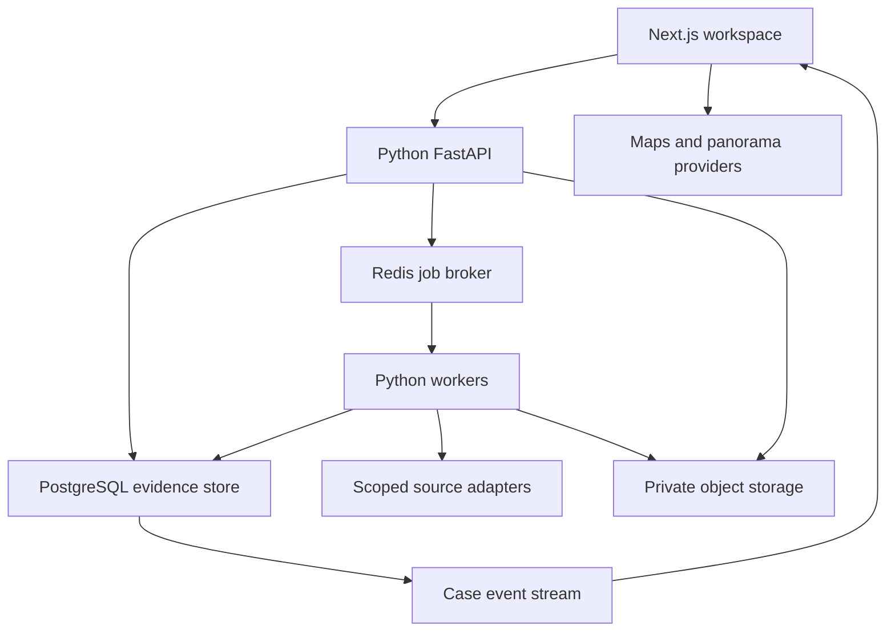

# PARALLAX architecture proposal

Version 0.4 planning revision · 8 October 2026 · Backend not implemented

See [Providers, local mode and cloud secrets](integrations-and-secrets.md) for the updated credential design and GitHub/Vercel deployment decision.

PARALLAX is a consent-scoped evidence workspace with a graph, maps, replay, analytics and a source-grounded assistant. Partial input starts a case; it does not establish a unique identity. A name, place or photograph can be ambiguous, and the system must preserve that ambiguity.

## Current dashboard

Implemented: graph and evidence views, replay-driven right and bottom charts, an Ask PARALLAX panel with local demonstration answers, a multi-input staging form and an interactive Leaflet/OpenStreetMap basemap. All case records and telemetry are fictional. Staged inputs remain in the browser session; no search or upload runs.

Google satellite, Street View and Earth currently open externally. The in-app modes explicitly show their unconnected state. Connecting them requires a Google Maps project and configuration. These are context maps, not real-time imagery or person locations.

## System layout

Start with a modular monolith and separately deployed workers. Keep case, identity, evidence, assistant and map modules explicit, but avoid independent services until workload measurements justify them.

| Component | Proposed choice | Responsibility |
| --- | --- | --- |
| Workspace | Existing Next.js / React / TypeScript | Graph, inspector, charts, maps, intake and Ask |
| API | Python FastAPI + Pydantic | Authentication, validation, case permissions, typed contracts |
| Database | PostgreSQL + PostGIS | Cases, claims, evidence, provenance, permitted geographic context |
| Retrieval | PostgreSQL full-text search + pgvector | Search within authorized case material |
| Jobs | Celery workers + Redis broker | Retrieval, parsing, indexing, aggregation and retries |
| Files | Private S3-compatible object store | Originals, derived documents and safe preview assets |
| Live updates | Server-sent events (SSE) | Durable progress and metric changes; ordinary HTTP for actions |
| Maps | Google Maps JavaScript, Maps 3D and Street View | Real provider imagery, navigation, orbit and panoramas |

Python fits the asynchronous data-processing workload without requiring the UI to use Python. PostgreSQL can serve the initial relationship graph through adjacency queries and bounded recursive queries. Add a separate graph database only if real traversals or scale require one.

## Intake and identity resolution

The intake accepts any combination of name or alias, account reference, address or place reference, URLs, photographs, documents, structured files and notes. Each seed records who supplied it, its stated origin and the applicable participant grant. The form accepts partial information and asks for no compulsory biography.

1. Create a case draft and attach the participant's existing enrollment and permitted-source scope. An operator selecting a checkbox is not proof of another person's consent.
2. Validate text and file limits. Upload files through short-lived, case-scoped URLs; verify content signatures, scan and parse in a restricted worker before indexing. Preserve originals and content hashes.
3. Normalize references without dropping the supplied form. Deduplicate records using source identifiers and hashes; retain multiple candidate matches when ambiguous.
4. Resolve only within enrolled participant material and authorized sources. A photo is reference evidence, not a trigger for identifying an unknown person or searching public-camera networks.
5. Show candidate evidence for review. Keep `unresolved`, `ambiguous`, `confirmed` and `rejected` states. Name similarity or one shared address cannot silently merge people.
6. Start permitted jobs and stream their actual progress. Scope changes or revocation cancel pending work and remove access to affected derived material.

Personal location data is case-restricted. Do not automatically extract private image-location metadata. An address seed does not establish current residence or current whereabouts. The architecture excludes unrestricted private-person dossiers, cross-camera identity tracking and inferred personality or sensitive-trait profiles.

## Evidence and relationship model

| Record | Important fields |
| --- | --- |
| Case / Membership | Owner, workspace, role, scope, retention policy |
| Participant / ConsentGrant | Verified enrollment, permitted purposes, sources, validity, revocation |
| InputSeed | Type, original value or file reference, supplied origin, participant, grant |
| Entity / Candidate | Stable ID, type, attributes, resolution state, reviewed matches |
| SourceRecord | Provider ID, URL, retrieval time, content hash, grant, permitted snapshot |
| Observation | Source span or media time range, extracted statement, extractor version |
| Claim | Subject, predicate, object, valid time, status, reviewer |
| ClaimEvidence | Claim, observation, support or contradiction, rationale |
| Job / CaseEvent | Idempotency key, step, state, sequence, timestamps, retry/error details |
| MetricBucket / AuditEvent | Case/time/window aggregates; access and mutation history |

Keep a claim separate from its evidence and from the entity it describes. Mother, sibling, friend and neighbor are different predicates requiring evidence appropriate to that relationship. Co-occurrence or a shared event alone does not prove them. Conflicting statements remain visible. Store both when an event reportedly happened and when PARALLAX learned about it.

An evidence score must document its calculation and inputs. It must not be presented as a probability of identity, truth or personality. Start with supported/review/disputed statuses and provenance; add calibrated numerical scoring only when it can be validated.

## Jobs, events and the dynamic dashboard

Use idempotent job steps, bounded retries, timeouts, per-provider rate limits, cancellation and explicit failed-job states. Redis delivers work; PostgreSQL remains the job system of record. Source adapters enforce permissions and allowed hosts, block private-network URL fetches and isolate untrusted files and content.

Write claim changes and an outbox event in the same database transaction. A dispatcher makes those events available to the SSE endpoint. Each event carries a unique ID, per-case sequence, case ID, type, event time and payload version. Reconnecting clients provide their last event ID and receive missed events; an expired cursor triggers a fresh snapshot.

The right panel should show records processed, extraction outcomes, relationship counts, evidence status and source freshness. The bottom panel should show volume over time, reviewed evidence scores and queue state. Charts subscribe to metric changes and share the replay cursor. Idle systems show idle or stale data; animation must not invent processing activity. Graph and chart clicks apply the same case filters.

## Ask PARALLAX

Ask receives the active case, selected entities, filters and replay cutoff. Retrieval filters by user, case and participant scope **before** returning text to a model. Answers cite source records and distinguish sourced claims, contradictions and missing evidence.

Expose a small set of read-only tools: query entities, inspect claims, retrieve source passages, summarize the current selection and explain a graph path. Treat retrieved pages and documents as untrusted data, never as system instructions. Reject uncited assertions and unsupported personal conclusions. Keep source navigation available from every answer. Models do not receive direct database write access or unrestricted network access.

## Real map integration

| Mode | Integration | Behavior |
| --- | --- | --- |
| 2D map / satellite | Google Maps JavaScript API map types | Pan, zoom, geographic layers and satellite imagery |
| Earth-style 3D | Maps JavaScript `maps3d` / `Map3DElement` | Photorealistic context with orbit, heading and tilt where available |
| Street View | `StreetViewPanorama` and panorama availability lookup | Actual panoramas, navigation, coverage and capture-date context |
| Current fallback | Leaflet/OpenStreetMap raster tiles + official Google outbound URLs | Usable map and external imagery while provider setup is pending |

Keep one geographic view state: center, zoom, heading, tilt and selected feature. Map navigation operates independently of identity matching. Overlay only source-backed, permitted locations with time and uncertainty; selecting a person does not imply a current coordinate. Street View and satellite imagery are not live camera feeds. Unavailable panorama or 3D coverage gets a clear empty state.

Use a billing-enabled Google Cloud project with browser keys restricted by domain and API. Keep server credentials separate and secret. Set quotas and spending alerts; preserve provider attribution and respect imagery storage restrictions. Load map libraries on demand so graph work does not incur unnecessary map initialization. The current raster map uses Leaflet and requires no WebGL. OSM community tiles are suitable for this small preview; select a provider with appropriate capacity and service guarantees before scaling. Fetch visible tiles only, preserve attribution and honor browser caching.

## API and deployment boundaries

Proposed versioned routes: `POST /v1/cases`, `POST /v1/cases/{id}/inputs`, `POST /v1/cases/{id}/uploads`, `POST /v1/cases/{id}/jobs`, `GET /v1/cases/{id}/graph`, `GET /v1/cases/{id}/claims`, `GET /v1/cases/{id}/metrics`, `GET /v1/cases/{id}/events` and `POST /v1/cases/{id}/ask`. Job creation returns a job ID and 202 response; workers do long processing outside HTTP requests. Use generated TypeScript API types from the OpenAPI contract, cursor pagination and structured error codes.

Deploy the portable Next.js frontend from GitHub to Vercel; the earlier Sites deployment remains a design preview. Run the Python API and workers as separate containers near managed PostgreSQL, a private Redis broker and the private object store. Frontend login does not automatically authenticate this separate API: use an explicit OIDC flow and validate token issuer, audience, expiry and case membership on every API request. Configure a same-origin gateway or narrow CORS rules; never trust a case ID or browser-provided role as authorization.

Use separate development/staging/production data, versioned migrations, encrypted backups and tested restore procedures. Redact personal material from operational logs. Record job latency, queue age, error rates, provider costs and stream reconnects. API instances scale by request load; worker pools scale by queue age and resource class. Retention and consent revocation must cover files, search indexes, caches and generated answers, including documented backup expiry.

## Build sequence and acceptance gates

1. **Workspace and contracts:** approve this UI; formalize schemas and fictional fixtures. Verify graph, filters, replay and chart consistency plus keyboard and reduced-motion behavior.
2. **Case foundation:** auth, enrollment, database, intake and file pipeline. Demonstrate isolation between two users/cases and correct revocation behavior.
3. **Evidence pipeline:** one permitted source adapter, workers, provenance and durable SSE. Demonstrate duplicate delivery, failure/retry and replay producing the same resulting case.
4. **Geospatial integration:** configure Google project, implement native modes and source-backed overlays. Verify missing coverage, expired keys, quotas and attribution.
5. **Assistant:** case-scoped retrieval and citations. Evaluate unsupported answers, contradictory sources and prompt-injection attempts with fixed fixtures.
6. **Operational readiness:** load testing against an agreed case/file/job workload, recovery drills, deletion checks, monitoring and deployment rollback. Set service targets from measurements before calling the system production-ready.

## Primary technical references

- [FastAPI](https://fastapi.tiangolo.com/)
- [Celery task queue](https://docs.celeryq.dev/en/stable/getting-started/introduction.html)
- [PostgreSQL recursive queries](https://www.postgresql.org/docs/current/queries-with.html)
- [PostGIS](https://postgis.net/docs/) and [pgvector](https://github.com/pgvector/pgvector)
- [Google Maps 3D](https://developers.google.com/maps/documentation/javascript/3d/overview)
- [Google map types](https://developers.google.com/maps/documentation/javascript/maptypes)
- [Street View integration](https://developers.google.com/maps/documentation/javascript/streetview)
- [Maps API key setup](https://developers.google.com/maps/documentation/javascript/get-api-key) and [API key restrictions](https://developers.google.com/maps/api-security-best-practices)
- [Official Google Maps URLs](https://developers.google.com/maps/documentation/urls/get-started)
